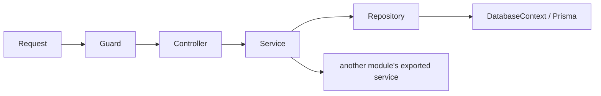

# Architecture overview

Nexora is one product-neutral NestJS modular monolith with feature-first module
ownership and one PostgreSQL schema.

## Normal flow

- Controllers validate transport input and map responses.
- Services own business workflows, authorization rechecks, transactions, audit,
  and reliable side-effect handoffs.
- Private concrete repositories own Prisma queries.
- Modules export only narrow services or intentional guards.

## Data ownership

| Module | Owned data |
| --- | --- |
| Users | `User` |
| Workspaces | `Workspace` |
| Memberships | `Membership`, `MembershipInvitation` |
| Sessions | `Session` |
| Authentication | `EmailVerification`, `PasswordResetToken` |
| Mail | `MailOutboxMessage` |
| Audit | `AuditLog` |

Only the owning module's repository may call that Prisma delegate. Cross-module
work uses exported services. Workspace is the only tenant boundary; every
tenant-owned query and audit write carries a server-resolved `workspaceId`.

## Transactions and mail

The feature service chooses what commits together. `TransactionManager` runs
serializable transactions and `DatabaseContext` supplies the active transaction
to concrete repositories. Verification, reset, and invitation requests insert
encrypted outbox mail in the same transaction as their token and audit record.
HTTP never reports provider delivery success. The mail worker owns delivery,
retry, fencing, and payload erasure.

## Authentication and authorization

1. Global route admission rejects unclassified handlers.
2. Exact trusted-origin checks run before protected browser mutations.
3. The opaque cookie hash resolves a durable PostgreSQL session.
4. User, workspace, and active membership are loaded server-side.
5. OWNER/MEMBER is derived from permanent workspace ownership.
6. Sensitive services recheck the exact session, membership, and resource in
   their transaction.

Client identity, workspace, or role headers never grant authority. Redis is used
for distributed rate limiting only.

## Product boundary

Core owns reusable account, tenant, membership, session, authorization, audit,
mail, configuration, persistence, health, and observability foundations. A
downstream product owns product workflows, schema, APIs, providers, prompts,
evaluation data, pricing, and UI. Core never imports a downstream product.
