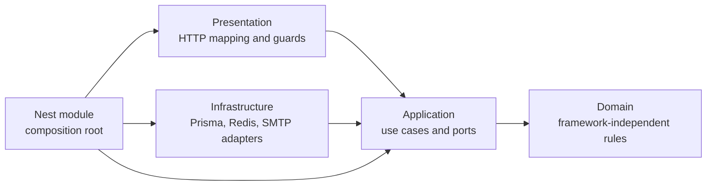

# Architecture overview

Nexora Platform Core is a reusable, product-neutral SaaS foundation. It is one
deployable NestJS modular monolith with a shared PostgreSQL schema and explicit
logical module ownership.

## Platform boundary

Core owns reusable identity, authentication, users, organizations, workspaces,
memberships, authorization, audit, configuration, persistence, operational
telemetry, and durable mail-delivery foundations.

A downstream product owns its customer workflow, product schema and APIs, UI,
provider behavior, prompts, retrieval, evaluations, pricing, and product usage
policy. Core must never import a downstream product. A product may consume only
narrow Core application contracts.

Promote a product capability into Core only after a second proven consumer or
an explicit platform requirement. See ADR-0002 and the downstream product guide
for the accepted boundary.

## Layers inside a capability

- **Presentation** validates transport input, resolves trusted context,
  authorizes, invokes one use case, and maps the result.
- **Application** coordinates module contracts and owns transaction boundaries.
- **Domain** contains business rules and stable domain errors without framework
  dependencies.
- **Infrastructure** implements inward-facing ports and owns external side
  effects.
- **Nest modules** wire implementations to tokens and expose intentional public
  application contracts.

The arrows describe dependency direction, not the chronological execution of a
request.

## Data ownership

Every Prisma model and business rule has one owning Core module. Only that
module's infrastructure may access its Prisma delegate. Cross-module work uses
stable IDs and application contracts rather than ORM objects.

`Workspace` is the operational tenant boundary. Tenant-owned reads, writes,
audits, sessions, mail, and resource lookups carry a server-resolved
`workspaceId`. `Organization` is the commercial boundary and is not a substitute
for workspace authorization.

The executable ownership map lives in
`test/architecture/architecture.spec.ts`; the human-readable map lives in the
[module catalog](../modules/README.md).

## Transactions and side effects

The application use case decides what must commit atomically. The shared
`TransactionManager` runs the callback at serializable isolation and maps known
write conflicts to a stable application error. Module repositories obtain the
active transaction through `DatabaseContext`.

Effects that must survive process failure are represented durably. For example,
verification, password-reset, and invitation email payloads are encrypted and
inserted into `MailOutboxMessage` inside the owning business transaction. An
immediate delivery attempt may happen after commit; the worker can safely retry
from durable state.

Redis is disposable acceleration and rate-limit state. PostgreSQL remains
authoritative for sessions and durable business facts.

## Authentication, admission, and authorization

These are separate decisions:

1. **Route admission** classifies every controller method as public,
   context-authenticated, or application-authenticated. Unclassified routes are
   denied.
2. **Authentication context** validates the opaque cookie against PostgreSQL and
   resolves the active user, workspace, membership, and organization.
3. **Authorization** evaluates a named permission against the resolved
   membership role and, inside use cases, checks resource-specific rules.

Client-supplied identity, workspace, organization, and role headers are never
trusted as authority.

## Stable boundaries worth protecting

- Domain code remains framework-independent.
- Core never imports product modules.
- Products never receive Prisma or Core infrastructure access.
- Controllers stay thin and do not own transactions.
- A module does not query another module's table.
- Every tenant-owned operation uses trusted workspace scope.
- Raw tokens, credentials, sensitive payloads, and provider errors stay out of
  normal logs.
- Planned baseline components are not described as implemented until code,
  configuration, and tests exist.
