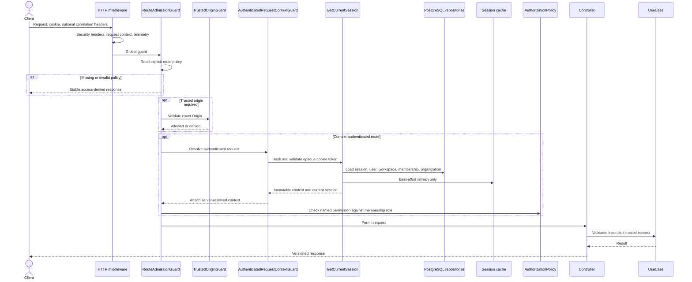

# Protected-request admission flow

Every Nest route is denied until its handler declares an admission policy. This
flow explains how a browser request becomes a trusted actor/workspace context
before business code runs.

## Sequence

## The three policy types

- **Public** routes do not require a tenant context. They can still require an
  exact trusted origin for browser mutation protection.
- **Authenticated** routes require the complete server-resolved context. Active
  status is the default; a route must explicitly allow pending-verification
  users. It may also require a named permission.
- **Application-authenticated** routes reserve session validation for a
  credential self-service use case that cannot require a complete tenant
  context, such as authenticated password change. This category is intentionally
  narrow.

## Why PostgreSQL is read on authenticated requests

Redis never grants authority. `GetCurrentSession` verifies durable session
state, expiry, revocation, user, active workspace, membership, and organization.
Redis is refreshed only after authoritative resolution and may be unavailable
without changing the result.

## Trusted context

The attached context contains session ID, actor user ID, user status,
organization ID, and workspace ID. It is immutable and created from server-side
records. Route identifiers and client headers cannot replace it.

The admission permission check is necessary but not always sufficient. Use
cases still enforce resource-specific rules such as role hierarchy,
active-workspace scope, foreign-resource concealment, and last-owner safety.

## Invariants to preserve

- A new controller method without an admission decorator fails closed.
- Origin validation happens before expensive session resolution when required.
- Pending-verification access is explicit and cannot carry a permission.
- Unknown user status, missing membership, expired/revoked session, or missing
  tenant records deny access.
- Foreign resource IDs cannot redirect a request into another workspace.
- Private responses retain the configured no-store and security headers.

## Code and tests

- Policy decorators: `src/core/authorization/presentation/route-admission.ts`
- Global guard: `src/core/authorization/presentation/route-admission.guard.ts`
- Context guard: `src/core/authentication/presentation/authenticated-request-context.guard.ts`
- Session resolver: `src/core/authentication/application/get-current-session.use-case.ts`
- Permission policy: `src/core/authorization/application/authorization-policy.ts`
- Unit tests: route-admission and authenticated-context specifications
- E2E evidence: `test/app.e2e-spec.ts` and the tenant-isolation matrices
