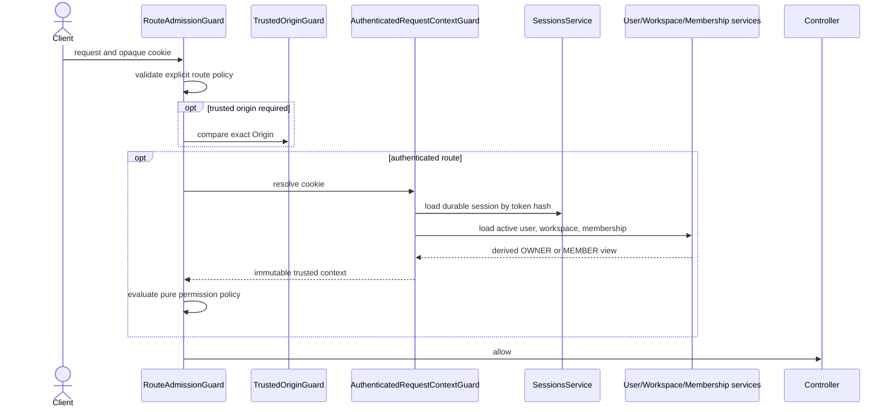

# Protected request admission

Every controller handler must declare admission metadata. Missing or malformed
metadata is denied by the one global `RouteAdmissionGuard`.

The trusted context contains only session ID, actor user ID/status, and
workspace ID. It is created from PostgreSQL records, never from client tenant or
role headers. Redis does not participate in session authority.

Admission is a coarse check. Sensitive services revalidate the exact durable
session, active membership, workspace ownership, and resource scope inside the
transaction. This protects against stale request snapshots and tenant A/B
identifier substitution.

Code: route decorators, `RouteAdmissionGuard`,
`AuthenticatedRequestContextGuard`, `SessionContextService`, and the pure
`authorization.policy.ts` functions.
