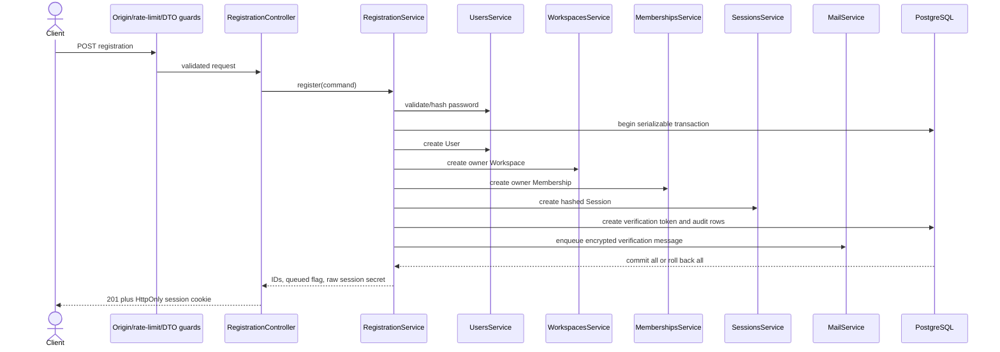

# Registration flow

`POST /v1/auth/registrations` creates the lean account graph as one transaction.
The request contains `email`, `password`, `displayName`, and `workspaceName`.

Email normalization and password hashing happen before the transaction. Inside
the transaction, each feature writes only its owned table. Duplicate normalized
email becomes the stable `EMAIL_ALREADY_REGISTERED` error. Any other persistence
failure rolls the entire graph back.

Only token hashes are stored. The raw verification token is encrypted inside the
outbox payload, and the raw session secret only reaches the cookie. The response
uses `verificationEmailQueued: true`; the mail worker performs delivery later.

The user remains `PENDING_VERIFICATION`. The registration session may access
only routes that explicitly allow pending users.

Evidence: `test/e2e/lean-core.e2e-spec.ts` and
`test/e2e/security-and-mail.e2e-spec.ts`.
