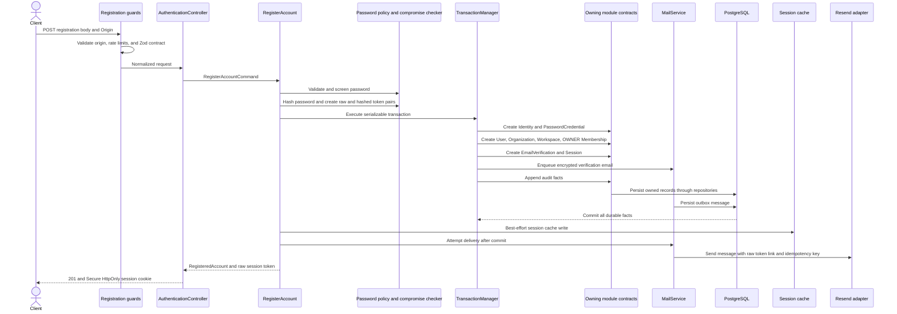

# Registration flow

`POST /v1/auth/registrations` is the default product-neutral onboarding policy.
It creates an identity, user, organization, initial workspace, OWNER membership,
verification intent, session, and audit facts as one business transaction.

## Sequence

## Before the transaction

The registration service normalizes email, validates password policy, checks compromise
data, hashes the password, and generates identifiers and token pairs. Failures
here create no account state.

Only hashes enter durable session and verification records. The raw verification
token exists long enough to build the protected mail payload; the raw session
token is returned only to the controller so it can set the cookie.

## Inside the transaction

The registration service owns one serializable transaction. Each called module
still writes through its own application contract and repository. The encrypted
mail outbox row is part of the transaction, so a committed verification intent
has a durable delivery handoff.

Duplicate normalized identity maps to a stable email-already-registered error.
Other transaction failures are logged without secrets and mapped to a stable
registration-unavailable error.

## After commit

Redis is populated best-effort because PostgreSQL owns session authority. An
immediate email delivery attempt improves latency, but its failure does not roll
back the account. Durable outbox state allows retry, and the API response reports
whether the immediate verification message was sent.

## Invariants to preserve

- All durable account and initial-tenant facts commit or roll back together.
- No raw password, session token, or verification token is persisted or logged.
- The initial membership is OWNER for the newly created workspace.
- The user remains `PENDING_VERIFICATION` until token confirmation.
- A cache or Resend outage cannot make a committed registration ambiguous.
- The flow remains product-neutral; downstream onboarding policy requires a
  separately reviewed contract change.

## Code and tests

- Controller: `src/modules/authentication/controllers/registration.controller.ts`
- Public service: `src/modules/authentication/services/registration.service.ts`
- Registration workflow: `src/modules/authentication/services/registration.service.ts`
- Unit tests: `src/modules/authentication/services/registration.service.spec.ts`
- E2E tests: `test/e2e/authentication.e2e-spec.ts`
- Transaction adapter: `src/infrastructure/database/prisma-transaction-manager.ts`
- Durable delivery: `src/modules/mail/mail.service.ts`
