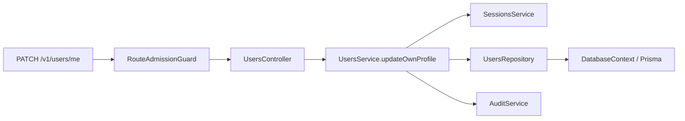

# Project tour

Nexora is one conventional NestJS modular monolith. Learn these five concepts
first:

```text
User --< Membership >-- Workspace
  |                         |
  |                         +-- permanent ownerUserId
  +-- Session(workspaceId)  +-- Invitation(email)
```

- User owns email, password, profile, and verification state.
- Workspace is an independent tenant with one permanent owner.
- Membership grants a user access to a workspace.
- Invitation grants future MEMBER access to exactly one workspace.
- Session authenticates one user in one active workspace.

There is no extra commercial grouping and no stored role. Public `OWNER` or
`MEMBER` is derived by comparing the user ID with `Workspace.ownerUserId`.

## Shortest reading path

1. `src/app.module.ts` composes the application.
2. `src/modules/users/users.module.ts` shows a small standard feature.
3. `src/modules/users/users.controller.ts` maps HTTP.
4. `src/modules/users/users.service.ts` owns the workflow.
5. `src/modules/users/users.repository.ts` contains private Prisma queries.
6. `prisma/schema.prisma` shows the five concepts and supporting security data.

Read every small feature in this order: module, controller, service, repository.

## One real request: update my profile



The controller validates a Zod DTO and receives server-resolved user/workspace
context. The service rechecks the session inside its transaction, updates the
trusted user, and appends the audit row. The controller never sees Prisma or a
repository.

## Directory map

```text
src/
  app.module.ts
  main.ts
  configure-app.ts
  config/
  common/
  infrastructure/
    infrastructure.module.ts
    database/
    cache/
  modules/
    users/
    workspaces/
    memberships/
    sessions/
    authentication/
    authorization/
    audit/
    mail/
    health/
    observability/
```

Small features keep `module/controller/service/repository` at their root.
Authentication and Mail are larger because they contain several workflows, but
each still has one obvious root module. `src/modules` has no parent module file,
so Nest CLI generation targets `AppModule` correctly.

For authentication, use the local
[`src/modules/authentication/README.md`](../../src/modules/authentication/README.md)
route-to-service map instead of reading every workflow at once.

## Contribution rules

- Controllers validate, map, and call one service method.
- Services own transaction boundaries and security-sensitive rechecks.
- Ordinary database access uses a private concrete repository, not an interface
  plus an adapter pair.
- Other modules use exported services only.
- Tenant-owned operations carry trusted `workspaceId` and need tenant A/B tests.
- Add an abstraction only for an external boundary, volatile policy, or second
  proven implementation.

Next: [create a module and add an endpoint](../how-to/create-a-module.md).
