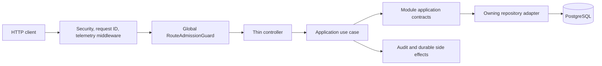

# Project tour

This tour gives you a reading order for the current single-package NestJS
modular monolith. It focuses on how the pieces cooperate rather than listing
every class.

## The shortest useful reading path

1. `src/main.ts` creates the Nest application.
2. `src/configure-app.ts` installs global HTTP behavior and creates OpenAPI.
3. `src/app.module.ts` composes infrastructure, observability, health,
   authentication, and authorization.
4. A controller under `src/core/<module>/presentation/` maps HTTP to one
   application use case.
5. The use case under `application/` owns orchestration and the transaction.
6. Repository ports live with the application code; Prisma implementations live
   under the owning module's `infrastructure/` directory.
7. `prisma/schema.prisma` is the development schema source of truth.
8. Unit, architecture, and E2E tests show the required behavior and boundaries.

## Request lifecycle



`RouteAdmissionGuard` denies routes that do not explicitly declare an admission
policy. For authenticated routes it resolves the actor and active workspace on
the server before a controller runs. See the
[protected-request flow](../flows/protected-request-admission.md).

## Directory map

```text
src/
  core/
    <capability>/
      domain/          framework-independent rules and errors
      application/     use cases, public contracts, and inward-facing ports
      infrastructure/  Prisma, Redis, Resend, encryption, and other adapters
      presentation/    controllers, guards, and transport contracts
  shared/              stable cross-module primitives only
prisma/
  schema.prisma        development schema source of truth
test/
  architecture/        executable dependency and ownership rules
  app.e2e-spec.ts      API behavior with real PostgreSQL and Redis
docs/
  adr/                 accepted decisions and consequences
  architecture/        current and target platform boundaries
  reference/           generated and lookup-oriented contracts
```

Not every capability needs all four layer directories. The dependency rules are
still the same: presentation calls application; infrastructure implements ports
defined inward; domain code does not import NestJS, Prisma, HTTP, Redis, or
provider SDKs.

## How modules communicate

Modules do not call each other through internal HTTP and must not query another
module's Prisma delegate. They consume narrow application contracts exported by
the owning Nest module. The architecture test in
`test/architecture/architecture.spec.ts` enforces the main dependency and table
ownership rules.

For example, registration is owned by Authentication but calls application
contracts owned by Identity, Users, Organizations, Workspaces, Memberships,
Audit, and Mail. The transaction remains owned by the registration use case.

## Where to answer common questions

| Question                              | Start with                                                     |
| ------------------------------------- | -------------------------------------------------------------- |
| Which route implements this behavior? | `docs/reference/openapi.json`, then the matching controller    |
| Why does this security rule exist?    | The nearest ADR and concept/flow guide                         |
| Who owns this table?                  | `docs/modules/README.md`, Prisma schema, and architecture test |
| What happens across several modules?  | A flow guide and the application use case                      |
| What is injected into this class?     | Its Nest module and generated Compodoc page                    |
| Is this current or only planned?      | Current-state baseline section plus live code/tests            |

## Run the project and references

Use the root README for environment setup. Once the API is running, open
`http://localhost:3000/docs` for Swagger UI. Generate local code navigation with
`pnpm run docs:code:serve`, then open the URL printed by Compodoc.
