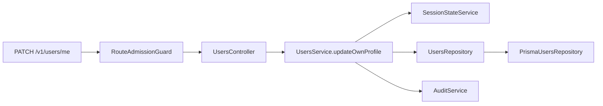

# Project tour

Nexora is one NestJS modular monolith. The outer folders follow normal NestJS
naming; the inner folders keep the security and data-ownership rules visible.

## The shortest useful reading path

1. `src/main.ts` starts Nest.
2. `src/configure-app.ts` installs global HTTP behavior and OpenAPI.
3. `src/app.module.ts` composes infrastructure and feature modules.
4. `src/modules/users/users.module.ts` shows one small conventional feature.
5. `src/modules/users/users.controller.ts` maps HTTP to the public service.
6. `src/modules/users/users.service.ts` owns the profile workflow and its
   transaction.
7. `src/modules/users/repositories/users.repository.ts` defines persistence;
   `infrastructure/prisma-users.repository.ts` implements it.

That is the default reading order for any feature: module, controller, service,
repository contract, then infrastructure adapter.

## One real request: update my profile

`PATCH /v1/users/me` is a compact example of the whole application.



The controller validates the Zod DTO and receives server-resolved actor and
workspace context. `UsersService` revalidates the session inside the
transaction, updates only the trusted user, and appends the audit record. The
controller never imports Prisma or a repository.

## Directory map

```text
src/
  app.module.ts
  main.ts
  configure-app.ts
  config/                    validated runtime configuration
  common/                    stable cross-module primitives and HTTP plumbing
  infrastructure/
    infrastructure.module.ts
    database/                Prisma and transaction context
    cache/                   Redis lifecycle
  modules/
    users/
      users.module.ts
      users.controller.ts
      users.service.ts
      dto/
      repositories/
      domain/
      infrastructure/
```

Complex features such as Authentication and Memberships may have
`controllers/`, `services/`, guards, or a named cycle-breaking submodule. They
still have one obvious root module. `src/modules` intentionally has no parent
module file, so the Nest CLI registers a new feature with `AppModule`.

## Rules that keep the simple shape safe

- Controllers validate, resolve trusted context, call a service, and map the
  response. They do not import repositories, Prisma, or infrastructure.
- Services own orchestration, authorization-sensitive rechecks, and transaction
  boundaries.
- Repository interfaces and tokens live in `repositories/`; Prisma adapters
  live in the same feature's `infrastructure/` directory.
- Other modules import only exported services, never another feature's
  repositories or adapters.
- Domain code stays independent of NestJS, Prisma, HTTP, Redis, and providers.

The executable rules are in `test/architecture/architecture.spec.ts`. See
[Create a module and add an endpoint](../how-to/create-a-module.md) for the
generator workflow and the extra steps required by authenticated or
tenant-owned operations.

## Where to answer common questions

| Question                              | Start with                                                     |
| ------------------------------------- | -------------------------------------------------------------- |
| Which route implements this behavior? | `docs/reference/openapi.json`, then the matching controller    |
| Why does this security rule exist?    | The nearest ADR and concept/flow guide                         |
| Who owns this table?                  | `docs/modules/README.md`, Prisma schema, and architecture test |
| What happens across several modules?  | A flow guide and the public service method                     |
| What is injected into this class?     | Its Nest module and generated Compodoc page                    |

Use the root README for environment setup. Once the API is running, open
`http://localhost:3000/docs` for Swagger UI.
